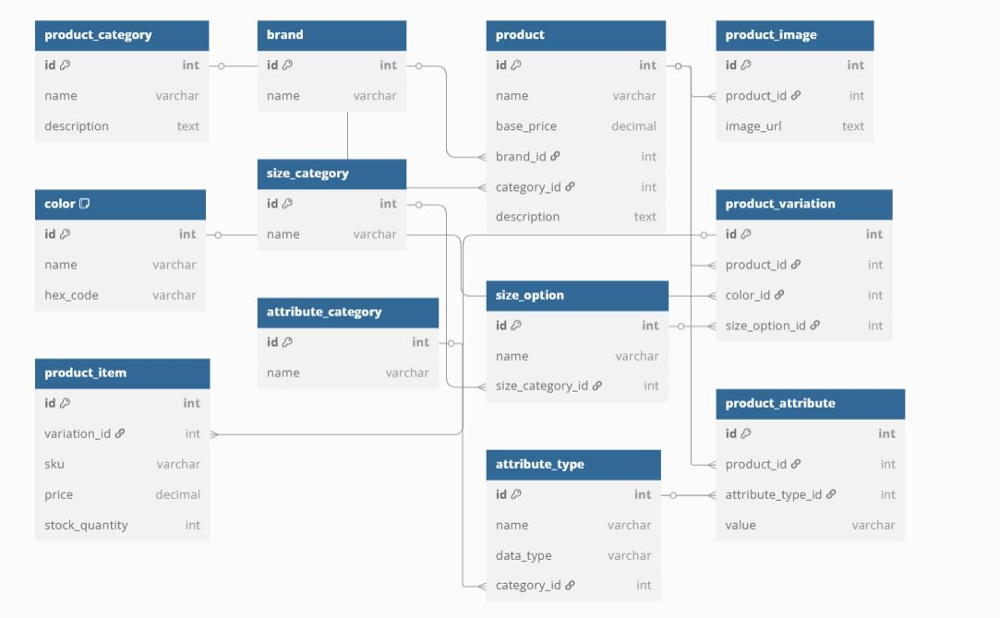

# ecommerce-database-project

# E-commerce Database Design with ERD and SQL Implementation

## Project Overview

This project focuses on designing an e-commerce database, creating an Entity-Relationship Diagram (ERD), and implementing the SQL code to create the database. It includes various tables, such as products, categories, variations, sizes, and custom attributes.

## Tools Used

- **ERD Tool**: dbdiagram.io
- **SQL Database**: MySQL (for SQL script implementation)

## Tables Designed

### Part 1: ERD + Core Tables (Grace)
- **brand**: Stores brand data.
- **product_category**: Stores product categories (e.g., clothing, electronics).
- **product**: Stores product details (name, price, brand, category).
- **product_image**: Stores image URLs for products.
- **product_item**: Stores specific items with variations like SKU, price, and stock quantity.

### Part 2: Product Variations, Sizes & Colors (Shadrack-Oguta)
- **color**: Stores color options for products.
- **size_category**: Groups size options (e.g., clothing sizes, shoe sizes).
- **size_option**: Specific size options (e.g., S, M, L, 42).
- **product_variation**: Links products with their color and size options.

### Part 3: Product Attributes System (Grace)
- **attribute_type**: Defines product attributes (e.g., material, weight).
- **attribute_category**: Groups attributes into categories.
- **product_attribute**: Links product attributes with specific products.

## SQL Scripts

The **ecommerce.sql** file contains the merged SQL scripts for creating all the necessary tables for the e-commerce database. This script combines the core tables, product variations, sizes, colors, and attributes system.

### Steps to Use the SQL Script:
1. Clone the repository:
    ```bash
    git clone https://github.com/gracequaye1/ecommerce-database-project.git
    ```

2. Import the final `ecommerce.sql` file into your MySQL database:
    ```sql
    source ecommerce.sql;
    ```

3. Enjoy working with the e-commerce database!

## ERD

The ERD diagram is designed using dbdiagram.io and can be found as `ecommerce_erd.png`.



## Folder Structure (Optional)

All files related to the project are stored in the root directory:

- **ecommerce_erd.png**: ERD diagram image
- **ecommerce.sql**: Final merged SQL script
- **README.md**: Project documentation

## Group Members & Tasks

- **Grace**: Part 1 - ERD and core tables (brand, product_category, product, product_image, product_item), Part 3 - Product attributes system (attribute_type, attribute_category, product_attribute)
- **Shadrack-Oguta**: Part 2 - Product variations, sizes, and colors (color, size_category, size_option, product_variation)


